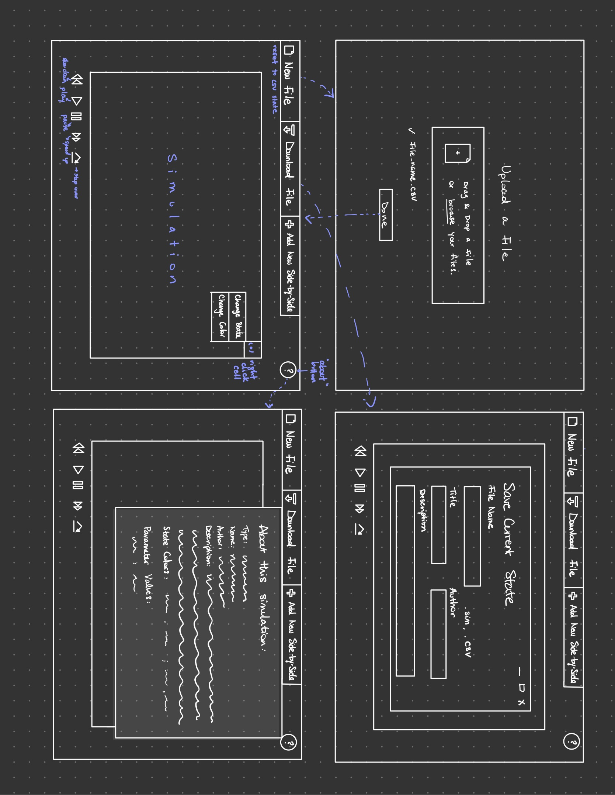

# Cell Society Design Plan

### Team Number 3

### Names

* Cate Schick
* Michelle Zhang
* Kyle White
* Samuel Li

## Design Overview

* Describe the classes you intend to create, without revealing any specific implementation details (
  like data structures, file formats, etc.). CRC cards can be a very useful way to develop your
  design.

|game| |
|---|---|
|hashmap onepass()      |game subclasses|

|file reader| |
|---|---|
|readfile()      |file type subclasses|

|View| |
|---|---|
|void update()      |game, file reader|

## Design Details

* Describe how your classes work together to handle specific features (like collaborating with other
  classes, using resource files, or serving as an abstraction that could be extended).

Main class creates a view, creates the different games. It gets the user input and passes it to the
fileReader class, which calls one of its subclasses. The fileReader returns a hashmap of the grid.
The main class then passes that grid to the game superclass and instantiates one of the game
subclasses. The game subclass does one iteration and returns to the view, which draws it.

All the games are subclasses of a game superclass, and the file formats are subclasses of a
filereader superclass.

## Design Considerations

* Describe at least two design issues your team encountered (even if you have not yet resolved it).
  Address any alternatives the team considered including pros and cons from all sides of the
  discussion.

#### Design Issue #1

Handling new games.

* Alernative #1
    * new superclass for each game

* Alernative #2
    * specific game as subclass of superclass

* Trade-offs
    * less reused code, easier to read.

#### Design Issue #2

Handling file types other than CSV.

 * Alternative #1
   * Abstracting FileReader class and implementing specific readFile methods depending
   on file type.

 * Alernative #2
   * Creating subclasses for each file type supported by program

 * Trade-offs
   * This makes the program more flexible to change

## User Interface

An Initial Sketch of the UI:

Additionally, some erroneous situations that would be reported to the user that we thought of are:

* bad input csv file
    * csv file is not formatted properly following spec
* no input in csv file
    * csv file is empty
* bad parameters
    * e.g. a negative number for probability of catching fire, or a negative number for Schelling's
      segregation model outsider tolerances, etc.

## Team Responsibilities

* Cate Schick
    * Model
        * file parsing
    * Game

* Michelle Zhang
    * View
        * file upload & save flow
        * about this simulation screen
        * languages 

* Kyle White
    * View
        * Create cell grid for view
        * Create cell view objects

* Samuel Li
    * implement game rules

#### Proposed Schedule

* finish plan by 10/18
* finish cell society by tuesday 10/19
* finish rest of the parts by friday 10/22
* debug over the weekend :) 